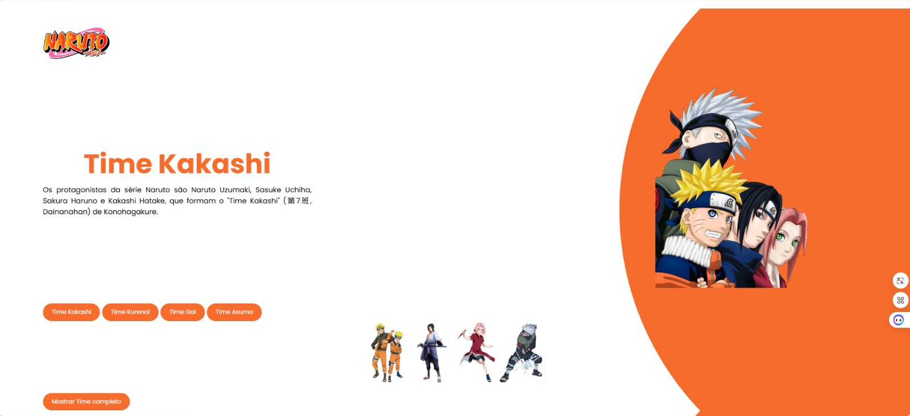

# 🍥 Página Naruto — Time 7

Página interativa sobre o **Time 7** de *Naruto* (Naruto Uzumaki, Sasuke Uchiha, Sakura Haruno e Kakashi Hatake). Ao clicar em um personagem, a página mostra o nome e a descrição dele, troca a imagem com uma animação de giro e muda a cor do círculo de fundo para combinar com o personagem.

> 🔗 **Demo:** https://pagina-naruto-git-v2-dev-alexandre-santos.vercel.app/

## 📸 Preview



## ✨ Funcionalidades

- Menu com os 4 personagens do Time 7, com efeito de elevação ao passar o mouse
- Ao clicar em um personagem:
  - exibe o **nome** e a **descrição**
  - troca a **imagem principal** com animação de giro
  - muda a **cor do círculo de fundo** (laranja, vermelho, azul ou cinza)
- Botão **"Mostrar Time 7"** que restaura a imagem do trio, limpa a descrição e volta à cor original
- Dados dos personagens organizados em um objeto JavaScript (sem `if/else` repetido)
- Tipografia com a fonte **Poppins** (Google Fonts)

## 🎨 Cores por personagem

| Personagem | Cor |
|---|---|
| Naruto Uzumaki | `#F66C2D` |
| Sakura Haruno | `#B2261E` |
| Sasuke Uchiha | `#082C8C` |
| Kakashi Hatake | `#A9A19F` |

## 🛠️ Tecnologias

| Tecnologia | Uso |
|---|---|
| HTML5 | Estrutura da página |
| CSS3 | Layout com Flexbox, `clip-path`, transições e animações (`@keyframes`) |
| JavaScript (puro) | Manipulação do DOM e troca dinâmica de conteúdo |

## 📁 Estrutura do projeto

```
Pagina-naruto/
├── img/              # imagens dos personagens, do trio e logo
├── index.html        # estrutura da página
├── styles.css        # estilos e animações
└── scripts.js        # lógica de interação
```

## 🚀 Como executar

```bash
# Clone o repositório na branch v2
git clone -b v2 https://github.com/DevAlexandreSantos/Pagina-naruto.git

# Entre na pasta
cd Pagina-naruto
```

Depois, abra o `index.html` no navegador ou use a extensão **Live Server** do VS Code.

## 🧠 Como funciona

Os personagens ficam em um objeto em `scripts.js`:

```js
const personagens = {
  naruto: { nome: 'Naruto Uzumaki', desc: '...', img: 'img/naruto.png' },
  // sakura, sasuke, kakashi...
};
```

A função `mostrarPersonagem(id)` lê esse objeto, atualiza o HTML e reinicia a animação `girar`. A função `trocarCor(cor)` altera o fundo do círculo, e `resetarPersonagem(cor)` volta ao estado inicial.

## 🔮 Próximos passos

- [ ] Deixar o layout totalmente responsivo para celular
- [ ] Adicionar mais personagens e times
- [ ] Renomear as imagens sem espaços (ex.: `time-7.png`)

## 👨‍💻 Autor

**Alexandre da Silva Santos**

[](https://github.com/DevAlexandreSantos)

## 📄 Licença

Projeto criado para fins de estudo e sem fins comerciais. Naruto e seus personagens pertencem a Masashi Kishimoto / Shueisha.